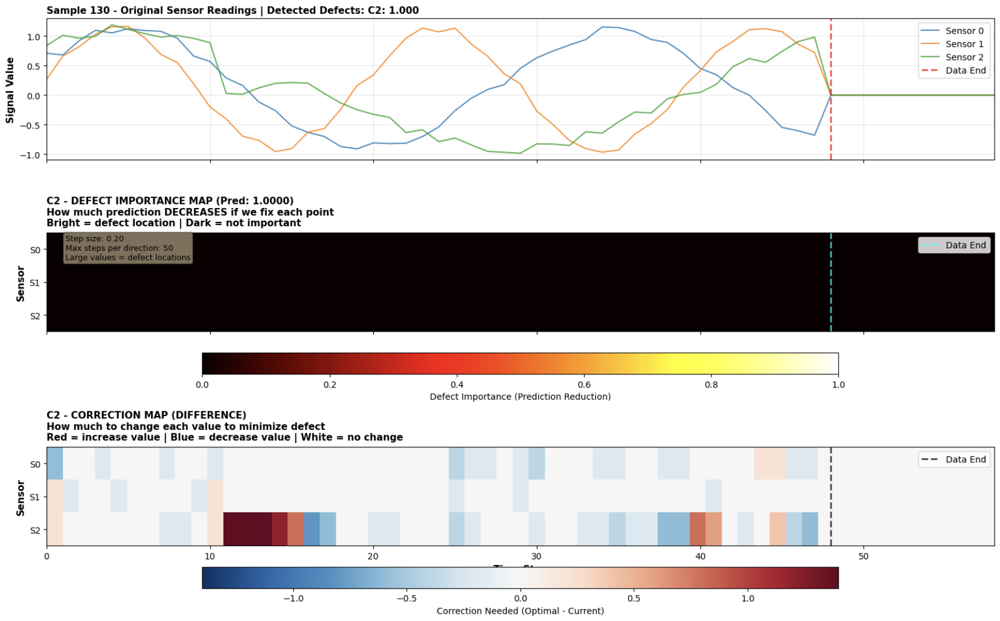

# Time Series Defect Detection & Explainability

**Michał Żurawski & Aleksander Hański**

We address multi-label classification of synthetic multivariate time series, where each series may contain zero or more of five distinct defect patterns.
Beyond classification, we emphasize model explainability — identifying which part of which sensor signal is responsible for a detected defect.

---



---

## Requirements

```
numpy
pandas
matplotlib
seaborn
scikit-learn
tensorflow / keras
```

## Dataset

The dataset is synthetically generated:

- 50,000 samples, each consisting of a 3-sensor time series of variable length (40–60 timesteps)
- Each series is a sinusoidal base signal with added Gaussian noise
- **5 defect classes** (multi-label, ~25% prevalence each):
  | Class | Defect Description |
  |-------|--------------------|
  | 0 | Single spike (+2) on sensor 0 |
  | 1 | Single dip (−2) on sensor 1 |
  | 2 | 4-timestep zero-out on sensor 2 |
  | 3 | 8-timestep elevation (+1.5) on sensor 1 |
  | 4 | 6-timestep simultaneous shift on sensors 0 (+1.5) and 2 (−1.5) |

## Model Architecture

The classifier uses a Keras `Model` with:

- **Conv1D** (32 filters, kernel 3, same padding) — local feature extraction
- **Masking** layer — handles variable-length sequences via padding
- **Bidirectional LSTM** — temporal sequence modeling
- **Custom Attention Layer** — soft weighting of timesteps for classification
- **Dense output** (5 units, sigmoid) — independent probability per class

Training uses early stopping and learning rate reduction on plateau.

## Explainability Approaches

### 1. Saliency Maps + Attention

Computes input gradients via `tf.GradientTape` to identify timesteps that most influence the model's prediction.
Attention weights are visualized alongside. This approach captures sensitivity but does not directly pinpoint the physical cause of a defect.

### 2. Optimal Value Analysis

For each timestep and sensor, systematically varies the input value and measures how the model's prediction for a given class changes.
The point where prediction change is maximized is identified as the likely defect location.

This produces a **Defect Importance Map** that highlights the specific sensor and timestep most responsible for triggering each class prediction —
more interpretable than gradient-based methods for this task.
